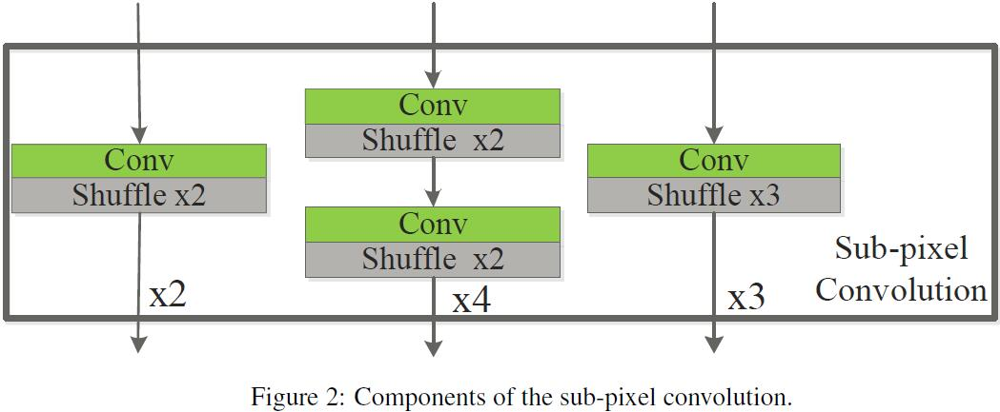
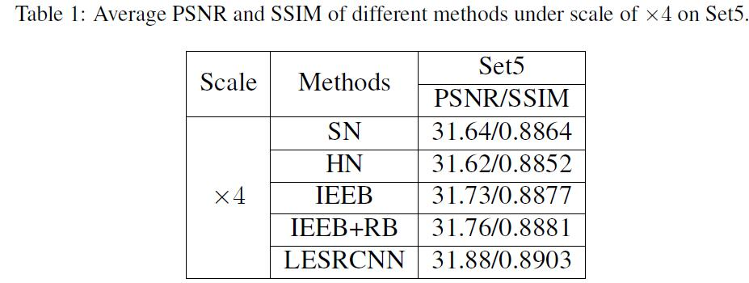
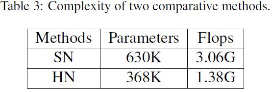
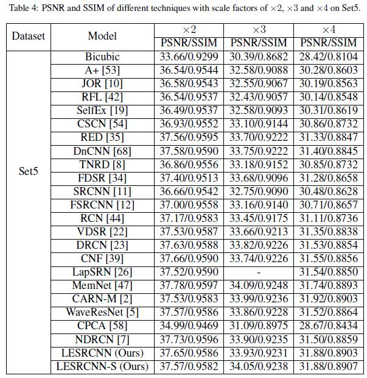
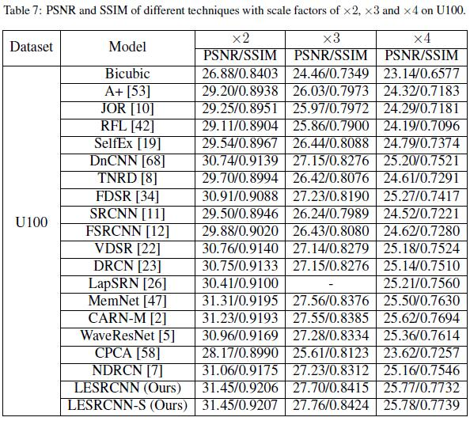
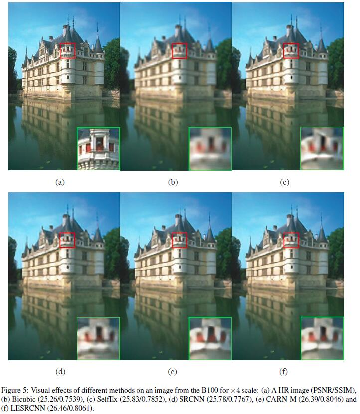

# LESRCNN
## Lightweight Image Super-Resolution with Enhanced CNN（LESRCNN）is conducted by Chunwei Tian, Ruibin Zhuge, Zhihao Wu, Yong Xu, Wangmeng Zuo, Chen Chen and Chia-Wen Lin, and accepted by Knowledge-Based Systems in 2020. It is implemented by Pytorch. And it is reported by Cver. 

### Abstract
#### Deep convolutional neural networks (CNNs) with strong expressive ability have achieved impressive performances on single image super-resolution (SISR). However, their excessive amounts ofconvolutions and parameters usually consume high computational cost and more memory storagefor training a SR model, which limits their applications to SR with resource-constrained devicesin real world. To resolve these problems, we propose a lightweight enhanced SR CNN (LESRCNN) with three successive sub-blocks, an information extraction and enhancement block (IEEB), a reconstruction block (RB) and an information refinement block (IRB). Specifically, the IEEB extracts hierarchical low-resolution (LR) features and aggregates the obtained features step-by-step to increase the memory ability of the shallow layers on deep layers for SISR. To remove redundant information obtained, a heterogeneous architecture is adopted in the IEEB. After that, the RB converts low-frequency features into high-frequency features by fusing global and local features, which is complementary with the IEEB in tackling the long-term dependency problem. Finally,the IRB uses coarse high-frequency features from the RB to learn more accurate SR features and construct a SR image. The proposed LESRCNN can obtain a high-quality image by a model fordifferent scales.  Extensive experiments demonstrate that the proposed LESRCNN outperforms state-of-the-arts on SISR in terms of qualitative and quantitative evaluation. 

## Requirements (Pytorch)  
#### Pytorch 0.41
#### Python 2.7
#### torchvision 
#### openCv for Python
#### HDF5 for Python
#### Numpy, Scipy
#### Pillow, Scikit-image
#### importlib

## Commands
### Training datasets 
#### The  training dataset is downloaded at https://pan.baidu.com/s/1uqdUsVjnwM_6chh3n46CqQ （secret code：auh1）(baiduyun) or https://drive.google.com/file/d/1TNZeV0pkdPlYOJP1TdWvu5uEroH-EmP8/view (google drive)

### Test datasets 
#### The  test dataset of Set5 is downloaded at 链接：https://pan.baidu.com/s/1YqoDHEb-03f-AhPIpEHDPQ (secret code：atwu) (baiduyun) or https://drive.google.com/file/d/1hlwSX0KSbj-V841eESlttoe9Ew7r-Iih/view?usp=sharing (google drive) 
#### The  test dataset of Set14 is downloaded at 链接：https://pan.baidu.com/s/1GnGD9elL0pxakS6XJmj4tA (secret code：vsks) (baiduyun) or https://drive.google.com/file/d/1us_0sLBFxFZe92wzIN-r79QZ9LINrxPf/view?usp=sharing (google drive) 
#### The  test dataset of B100 is downloaded at 链接：https://pan.baidu.com/s/1GV99jmj2wrEEAQFHSi8jWw （secret code：fhs2) (baiduyun) or https://drive.google.com/file/d/1G8FCPxPEVzaBcZ6B-w-7Mk8re2WwUZKl/view?usp=sharing (google drive) 
#### The  test dataset of Urban100 is downloaded at 链接：https://pan.baidu.com/s/15k55SkO6H6A7zHofgHk9fw (secret code：2hny) (baiduyun) or https://drive.google.com/file/d/1yArL2Wh79Hy2i7_YZ8y5mcdAkFTK5HOU/view?usp=sharing (google drive) 

### preprocessing
### cd dataset
### python div2h5.py

### Training a model for single scale  
### x2
#### python train.py --patch_size 64 --batch_size 64 --max_steps 600000 --decay 400000 --model lesrcnn --ckpt_name lesrcnn_x2 --ckpt_dir checkpoint/lesrcnn_x2 --scale 2 --num_gpu 1       

### x3
#### python train.py --patch_size 64 --batch_size 64 --max_steps 600000 --decay 400000 --model lesrcnn --ckpt_name lesrcnn_x3 --ckpt_dir checkpoint/lesrcnn_x3 --scale 3 --num_gpu 1 

### x4
#### python train.py --patch_size 64 --batch_size 64 --max_steps 600000 --decay 400000 --model lesrcnn --ckpt_name lesrcnn_x4 --ckpt_dir checkpoint/lesrcnn_x4 --scale 4 --num_gpu 1 

### Training a model for different scales (also regarded as blind SR)
#### python train.py --patch_size 64 --batch_size 64 --max_steps 600000 --decay 400000 --model lesrcnn --ckpt_name lesrcnn --ckpt_dir checkpoint/lesrcnn --scale 0 --num_gpu 1 

### Test 
### Single SR mode for x2
#### python x2/tcw_sample.py --model lesrcnn --test_data_dir dataset/Urban100 --scale 2 --ckpt_path ./x2/lesrcnn_x2.pth --sample_dir samples_singlemodel_urban100_x2

### Single SR model for x3
#### python x3/tcw_sample.py --model lesrcnn --test_data_dir dataset/Urban100 --scale 3 --ckpt_path ./x3/lesrcnn_x3.pth --sample_dir samples_singlemodel_urban100_x3

### Single SR model for x4
#### python x4/tcw_sample.py --model lesrcnn --test_data_dir dataset/Urban100 --scale 4 --ckpt_path ./x4/lesrcnn_x4.pth --sample_dir samples_singlemodel_urban100_x4

### Single SR model for x2, x3 and x4
###  x2
#### python x2/tcw_sample.py --model lesrcnn --test_data_dir dataset/Urban100 --scale 2 --ckpt_path lesrcnn_b/lesrcnn.pth --sample_dir samples_lesrcnn_b_urban100_x2

### x3
#### python x3/tcw_sample.py --model lesrcnn --test_data_dir dataset/Urban100 --scale 3 --ckpt_path lesrcnn_b/lesrcnn.pth --sample_dir samples_singlemodel_urban100_x3

### x4
#### python x4/tcw_sample.py --model lesrcnn --test_data_dir dataset/Urban100 --scale 4 --ckpt_path lesrcnn_b/lesrcnn.pth  --sample_dir samples_singlemodel_urban100_x4

### Using a model to test different scales of 2,3 and 4 (also regarded as blind SR)
#### python lesrcnn_b/tcw_sample_b.py --model lesrcnn --test_data_dir dataset/Urban100 --scale 2 --ckpt_path lesrcnn_b/lesrcnn.pth  --sample_dir samples_singlemodel_urban100_x2

#### python lesrcnn_b/tcw_sample_b.py --model lesrcnn --test_data_dir dataset/Urban100 --scale 3 --ckpt_path lesrcnn_b/lesrcnn.pth  --sample_dir samples_singlemodel_urban100_x3

#### python lesrcnn_b/tcw_sample_b.py --model lesrcnn --test_data_dir dataset/Urban100 --scale 4 --ckpt_path lesrcnn_b/lesrcnn.pth  --sample_dir samples_singlemodel_urban100_x4 

### The Network architecture, principle and results of LESRCNN

### 1. Network architecture of LESRCNN.

### 2. Varying scales for upsampling operations.

### 3. Effectivenss of key components of LESRCNN.

### 4. Running time of key components of LESRCNN.

### 5. Complexity of key components of LESRCNN.

### 6. LESRCNN for x2, x3 and x4 on Set5.

### 7. LESRCNN for x2, x3 and x4 on Set14.

### 8. LESRCNN for x2, x3 and x4 on B100.

### 9. LESRCNN for x2, x3 and x4 on U100.

### 9. Running time of different methods on hr images of size 256x256, 512x512 and 1024x1024 for x2.

### 10. Complexities of different methods for x2.

### 11. Visual results of U100 for x2.

### 12. Visual results of Set14 for x3.

### 13. Visual results of B100 for x4.

### If you cite this paper, please the following format:  
#### 1.Tian C, Zhuge R, Wu Z, et al. Lightweight image super-resolution with enhanced CNN[J]. Knowledge-Based Systems, 2020: 106235.
#### 2.@article{tian2020lightweight,
####  title={Lightweight Image Super-Resolution with Enhanced CNN},
####  author={Tian, Chunwei and Zhuge, Ruibin and Wu, Zhihao and Xu, Yong and Zuo, Wangmeng and Chen, Chen and Lin, Chia-Wen},
####  journal={Knowledge-Based Systems},
####  pages={106235},
####  year={2020},
####  publisher={Elsevier}
####  }
