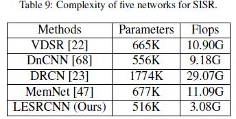
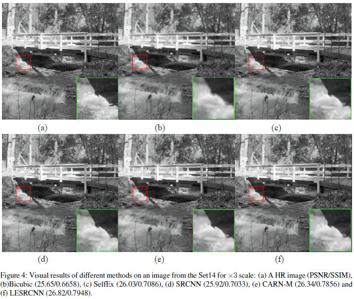

# LESRCNN
## Lightweight Image Super-Resolution with Enhanced CNN（LESRCNN）is conducted by Chunwei Tian, Ruibin Zhuge, Zhihao Wu, Yong Xu, Wangmeng Zuo, Chen Chen and Chia-Wen Lin, and accepted by Knowledge-Based Systems in 2020. It is implemented by Pytorch.

### Abstract
#### Deep convolutional neural networks (CNNs) with strong expressive ability have achieved impressive performances on single image super-resolution (SISR). However, their excessive amounts ofconvolutions and parameters usually consume high computational cost and more memory storagefor training a SR model, which limits their applications to SR with resource-constrained devicesin real world. To resolve these problems, we propose a lightweight enhanced SR CNN (LESRCNN) with three successive sub-blocks, an information extraction and enhancement block (IEEB), a reconstruction block (RB) and an information refinement block (IRB). Specifically, the IEEB extracts hierarchical low-resolution (LR) features and aggregates the obtained features step-by-step to increase the memory ability of the shallow layers on deep layers for SISR. To remove redundant information obtained, a heterogeneous architecture is adopted in the IEEB. After that, the RB converts low-frequency features into high-frequency features by fusing global and local features, which is complementary with the IEEB in tackling the long-term dependency problem. Finally,the IRB uses coarse high-frequency features from the RB to learn more accurate SR features and construct a SR image. The proposed LESRCNN can obtain a high-quality image by a model fordifferent scales.  Extensive experiments demonstrate that the proposed LESRCNN outperforms state-of-the-arts on SISR in terms of qualitative and quantitative evaluation. 

### The Network architecture, principle and results of LESRCNN

### 1. Network architecture of LESRCNN.

### 2. Varying scales for upsampling operations.

### 3. Effectivenss of key components of LESRCNN.

### 4. Running time of key components of LESRCNN.

### 5. Complexity of key components of LESRCNN.

### 6. LESRCNN for x2, x3 and x4 on Set5.

### 7. LESRCNN for x2, x3 and x4 on Set14.

### 8. LESRCNN for x2, x3 and x4 on B100.

### 9. LESRCNN for x2, x3 and x4 on U100.

### 9. Running time of different methods on hr images of size 256x256, 512x512 and 1024x1024 for x2.

### 10. Complexities of different methods for x2.

### 11. Visual results of U100 for x2.

### 12. Visual results of Set14 for x3.

### 13. Visual results of B100 for x4.

### If you cite this paper, please the following format:  
#### 1.Tian C, Zhu R, Wu Z, et al. Lightweight Image Super-Resolution with Enhanced CNN[J]. Knowledge-Based Systems, 2020.  
#### 2.@article{tian2020lightweight,
####  title={Lightweight Image Super-Resolution with Enhanced CNN},
####  author={Tian, Chunwei and Zhuge, Ruibin and Wu, Zhihao and Xu, Yong and Zuo, Wangmeng and Chen, Chen and Lin, Chia-Wen},
####  journal={Knowledge-Based Systems},
####  year={2020},
####  publisher={Elsevier}
####  }
